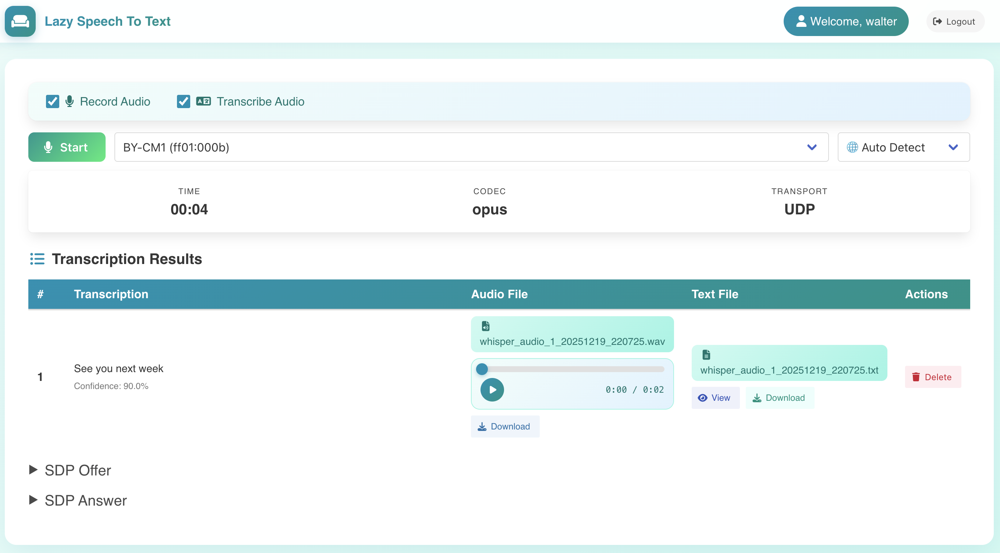

# 🎙️ Lazy Speech To Text Converter

> Forked from [webrtc-speech-to-text](https://github.com/rviscarra/webrtc-speech-to-text), with a Vue 3 frontend, multi-vendor transcription (Whisper, Google, Azure, Baidu, Xunfei), audio recording, and file management.

<p align="center">
  
</p>

<p align="center">
  <strong>Transform speech to text effortlessly with WebRTC and AI</strong>
</p>

---

## ✨ Features

| Feature | Description |
|---------|-------------|
| 🎤 **Real-time Streaming** | WebRTC-based audio capture with low latency |
| 🌍 **99+ Languages** | Powered by Whisper AI - works offline |
| 🔒 **Privacy First** | Local processing - your audio never leaves your machine |
| 📱 **Cross-platform** | Works on Chrome, Firefox, and Safari |
| 🎛️ **Flexible Options** | Record only, transcribe only, or both |
| 📊 **Visual Feedback** | Real-time audio waveform visualization |
| 🔐 **User Authentication** | Simple login system for access control |

---

## 🚀 Quick Start

```bash
# 1. Install Whisper (one-time)
pip install whisper-ctranslate2

# 2. Build the project
make

# 3. Run the server
./webrtc-transcriber

# 4. Open browser
open http://localhost:9070
```

**That's it!** No cloud accounts, no API keys, no configuration needed.

> See [Runbook](doc/06-runbook.md) for prerequisites, troubleshooting, and alternative vendors.

---

## 🏗️ Architecture

```
┌─────────────┐     WebRTC      ┌─────────────────┐     Audio      ┌──────────────┐
│   Browser   │ ◄─────────────► │  Go Server      │ ─────────────► │  Whisper AI  │
│  (Vue 3)    │                 │  (Pion WebRTC)  │                │  (or Cloud)  │
└─────────────┘                 └─────────────────┘                └──────────────┘
       │                               │                                  │
       │    DataChannel               │                                  │
       ◄──────────────────────────────┼──────────────────────────────────┘
              (Transcription Results)
```

| Layer | Technology |
|-------|-----------|
| **Backend** | Go + Pion WebRTC + Opus |
| **Frontend** | Vue 3 + TypeScript + Vite + Tailwind CSS |
| **Transcription** | Whisper (default), Google, Azure, Baidu, Xunfei |

> See [Architecture](doc/02-architecture.md) for component diagrams, call chains, and module dependencies.

---

## ⚙️ Usage

```bash
./webrtc-transcriber [options]

  --vendor string     whisper | google | azure | baidu | xunfei | recorder (default "whisper")
  --model string      tiny | base | small | medium | large (default "small")
  --language string   en | zh | ja | auto | ... (default "auto")
  --output string     Output directory (default "recordings")
  --http.port string  HTTP port (default "9070")
```

Copy `env.example` to `.env` for cloud vendor credentials and account configuration.

> See [Data & API](doc/04-data-and-api.md) for full HTTP API contracts and [Conventions](doc/05-conventions.md) for configuration details.

---

## 📚 Documentation

The `doc/` directory contains a comprehensive **Project Knowledge Base** built with [Sphinx](https://www.sphinx-doc.org/) + [MyST Markdown](https://myst-parser.readthedocs.io/).

```bash
cd doc/
pip install -r requirements.txt   # One-time setup
make html                          # Build HTML documentation
make serve                         # Build with live reload
```

| Document | Description |
|----------|-------------|
| [Project Overview](doc/00-overview.md) | Purpose, boundaries, tech stack, deployment model |
| [Repository Map](doc/01-repo-map.md) | Directory structure, entry points, naming conventions |
| [Architecture](doc/02-architecture.md) | Component diagram, call chains, module dependencies |
| [Workflows](doc/03-workflows.md) | Real-time transcription, file management, vendor selection |
| [Data & API](doc/04-data-and-api.md) | HTTP API contracts, DataChannel messages, Go interfaces |
| [Conventions](doc/05-conventions.md) | Code style, error handling, config management |
| [Runbook](doc/06-runbook.md) | Build, run, debug, and troubleshoot |
| [Testing](doc/07-testing.md) | Test strategy, coverage targets, critical path checklist |
| [AI Guide](doc/ai-guide.md) | Orientation guide for AI assistants |

### Vendor Setup Guides

- [Whisper Setup](docs/WHISPER_SETUP.md) · [Azure Setup](docs/AZURE_SETUP.md) · [Baidu Setup](docs/BAIDU_SETUP.md) · [Xunfei Setup](docs/XUNFEI_SETUP.md) · [Recorder Setup](docs/RECORDER_SETUP.md)

---

## ⚠️ Disclaimer

This project is a **proof of concept** and should not be deployed in production without implementing proper security measures.

## 📄 License

MIT - see [LICENSE](LICENSE) for details.

---

<p align="center">
  Made with ❤️ by <a href="mailto:walter.fan@gmail.com">Walter Fan</a>
</p>
